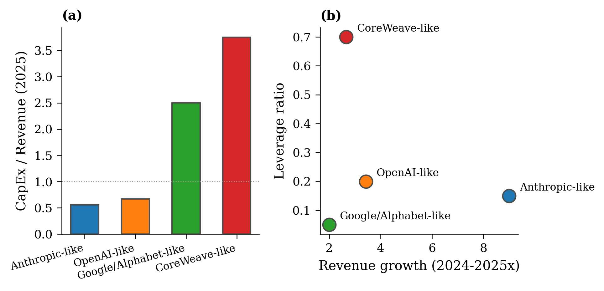

## Calibration: Parameters {.smaller}

| Parameter | Value | Source |
|:----------|:------|:-------|
| $r$ (risk-adjusted discount) | 0.12 | Representative WACC |
| $\mu_L, \mu_H$ (growth) | 0.01, 0.06 | Cloud revenue data |
| $\sigma_L, \sigma_H$ (vol) | 0.25, 0.30 | Revenue volatility |
| $\alpha$ (revenue elasticity) | 0.40 | Scaling laws |
| $\gamma$ (cost convexity) | 1.50 | Supply chain data |
| $\lambda$ (baseline) | 0.10 | Moderate prior |

---

## Calibration: Stylized Firms {.smaller}

| | Frontier Lab | Platform | Hyperscaler | Compute Racer |
|:--|:------------|:---------|:------------|:--------------|
| *Archetype* | Anthropic | OpenAI | Google | xAI |
| Revenue '25 (\$B) | 3.0 | 12.0 | 55.0 | 2.0 |
| CapEx '25 (\$B) | 6.0 | 15.0 | 60.0 | 10.0 |
| **CapEx / Revenue** | **2.00** | **1.25** | **1.09** | **5.00** |
| Leverage | 0.20 | 0.30 | 0.10 | 0.25 |

::: {.fragment}
**Key observation**: All firms have CapEx > Revenue (historically unusual)

$\Rightarrow$ Investing far ahead of current demand
:::

---

## Firm Comparison

{width="90%"}

All firms above 1.0x CapEx/Revenue; distinct clusters in growth-leverage space

---

## Baseline Results

**Single-firm** (H regime): $X^* \approx 0.016$, $K^* \approx 0.055$

**Duopoly equilibrium**:

- Follower: $X_F \approx 1.0$, $K_F \approx 3.5$
- Leader invests earlier via preemption: $X_P \approx 0.009 < X_F$

::: {.fragment}
**Strategic interaction**:

- Accelerates investment (preemption trigger below monopolist trigger)
- Reduces per-firm capacity (revenue sharing)
- With leverage: raises credit spreads 50--400+ bps depending on $\ell$
:::

---
