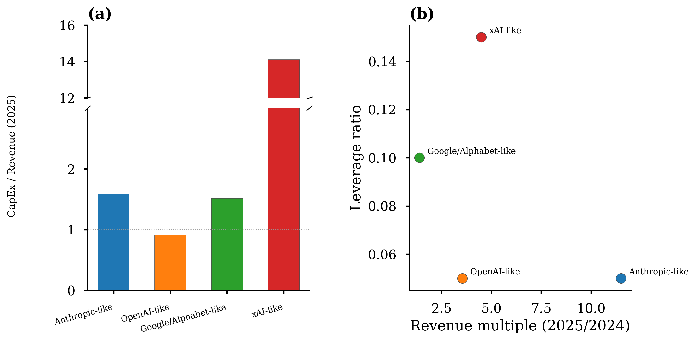

## Calibration: Parameters {.smaller}

| Parameter | Value | Source |
|:----------|:------|:-------|
| $r$ (risk-adjusted discount) | 0.12 | Representative WACC |
| $\mu_L, \mu_H$ (growth) | 0.01, 0.06 | Cloud revenue data |
| $\sigma$ (vol) | 0.25 | Revenue volatility |
| $\alpha$ (revenue elasticity) | 0.40 | Scaling laws |
| $\gamma$ (cost convexity) | 1.50 | Supply chain data |
| $\lambda$ (baseline) | 0.10 | Moderate prior |

---

## Calibration: Stylized Firms {.smaller}

| | Frontier Lab | Platform | Hyperscaler | Compute Racer |
|:--|:------------|:---------|:------------|:--------------|
| *Archetype* | Anthropic | OpenAI | Google | xAI |
| Revenue 2025 (\$B) | 4.6 | 13.1 | 60.0 | 0.9 |
| CapEx 2025 (\$B) | 7.3 | 12.0 | 91.0 | 12.7 |
| **CapEx / Revenue** | **1.59** | **0.92** | **1.52** | **14.1** |
| Leverage | 0.05 | 0.05 | 0.10 | 0.15 |
| Training $\hat{\phi}$ | 0.55 | 0.60 | 0.35 | 0.75 |

::: {.fragment}
**Key observation**: xAI-like compute racer invests 14$\times$ revenue; others between 0.9$\times$ and 1.6$\times$

$\Rightarrow$ Extreme heterogeneity in investment intensity reflects heterogeneous beliefs about $\lambda$
:::

---

## Firm Comparison

{width="90%"}

xAI-like compute racer at 14$\times$; other firms between 0.9$\times$ and 1.6$\times$; distinct clusters in growth-leverage space

---

## Baseline Results

**Single-firm** (phi-aware): $X^* \approx 0.0047$, $K^* \approx 0.0067$, $\phi^* \approx 0.70$

**Duopoly equilibrium** (zero leverage):

- Follower: $X_F \approx 0.57$, $K_F \approx 1.30$, $\phi_F \approx 0.70$
- Leader preempts at $X_P \approx 0.0082 < X_H^{\text{mono}} \approx 0.0163$

::: {.fragment}
**Strategic interaction**:

- Accelerates investment: preemption trigger $\approx 50\%$ of monopolist trigger
- Reduces per-firm capacity (revenue sharing)
- With leverage: credit spreads 170--310 bps; 5-yr default under 2\% across $\ell \in [0.05, 0.70]$
:::

---
