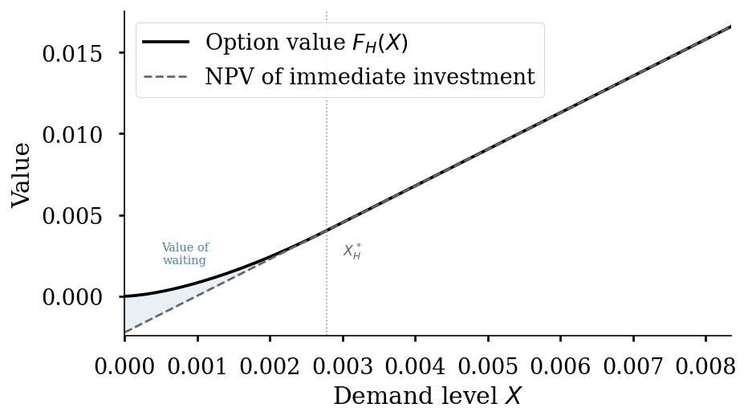
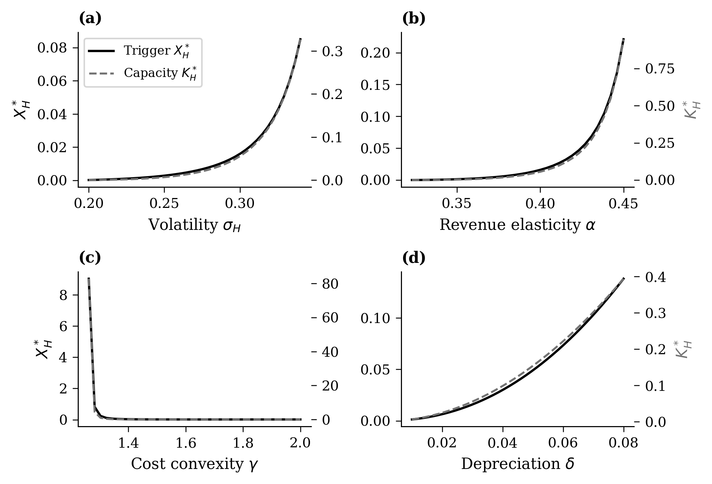
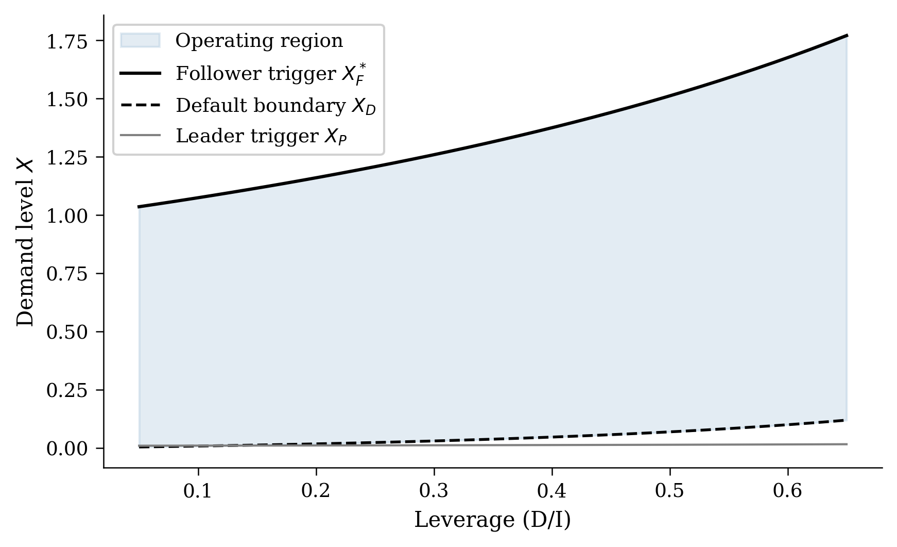
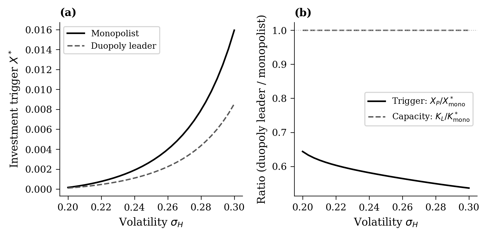

## Model: Environment {.smaller}

**Demand** follows regime-switching GBM:
$$dX_t = \mu_s X_t \, dt + \sigma_s X_t \, dW_t, \quad s \in \{L, H\}$$

::: {.columns}
::: {.column width="50%"}
- **Low regime** ($L$): moderate growth, current AI market
- Switch to $H$ with Poisson rate $\lambda$
- **High regime** ($H$): transformative AI demand (absorbing)
:::
::: {.column width="50%"}
- $\lambda$ = firm's belief about AI timelines
- $\lambda = 0.5$: expect switch in 2 years
- $\lambda = 0.1$: expect switch in 10 years
:::
:::

---

## Model: Technology

**Investment**: irreversible, lump-sum $I(K) = cK^\gamma$, $\gamma > 1$

- Convex costs: diminishing returns to scale (consistent with scaling laws)

**Revenue** (monopolist): $\pi = X K^\alpha$, $\alpha \in (0,1)$

- Diminishing returns to capacity in revenue generation

**Competition** (Tullock contest):
$$\pi_i = X \cdot \frac{K_i^{2\alpha}}{K_i^\alpha + K_j^\alpha}$$

- Diminishing returns: governs division of revenue across firms

---

## Single-Firm Benchmark

**Firm chooses**: trigger $X^*$ (when) and capacity $K^*$ (how much)

**Key insight**: optimal trigger has the classic form
$$X^* = \underbrace{\frac{\beta_H}{\beta_H - 1}}_{\text{option premium}} \cdot \text{(Marshallian trigger)}$$

---

## Option Value vs. NPV

{width="90%"}

Shaded region = value of waiting; vertical line = optimal trigger $X_H^*$

---

## Comparative Statics

{width="90%"}

Higher $\sigma_H$, $\alpha$, $\gamma$ raise the trigger; effects on capacity vary

---

## Duopoly: Preemption Equilibrium

::: {.columns}
::: {.column width="50%"}
**Sequential entry**:

1. Leader invests at $X_P$ (preemption trigger)
2. Follower invests at $X_F > X_P$
3. Rent equalization: $L(X_P) = F(X_P)$
:::
::: {.column width="50%"}
**Key trade-off**:

- Invest early $\Rightarrow$ preempt rival, monopoly rents
- Invest late $\Rightarrow$ more information, less risk
- **With leverage**: also risk default if demand disappoints
:::
:::

---

## Duopoly: Default Risk

**Endogenous default** [@leland1994corporate]: equity holders default when $E(X) = 0$

$$X_D = \frac{(\delta K + d)(r - \mu_s)(K_i^\alpha + K_j^\alpha)}{r K_i^\alpha}$$

**Proposition**: Higher leverage *and* stronger competition both raise $X_D$

---

## Investment and Default Boundaries

{width="90%"}

Shaded = operating region; narrows dangerously at high leverage

---

## Competition Effect: Monopoly vs. Duopoly

{width="90%"}

Preemption cuts leader trigger to ~50% of monopolist; capacity nearly unchanged

---
