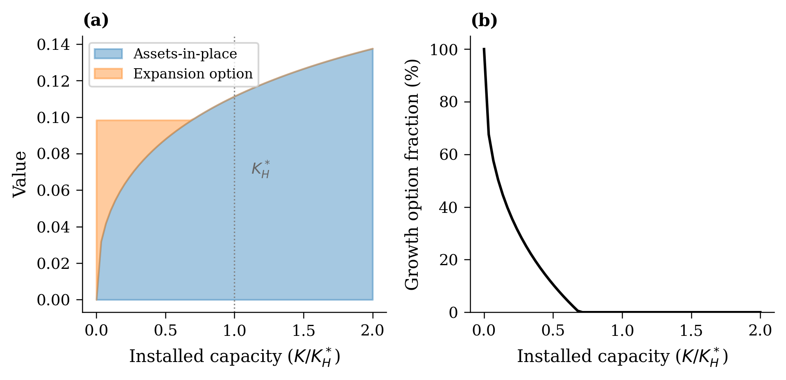

## N-Firm Equilibrium

**Backward induction** [@bouis2009multistage] for $N$ symmetric firms:

::: {.columns}
::: {.column width="50%"}
- Firms enter sequentially
- Revenue sharing: $\pi_i = X \frac{K_i^\alpha}{\sum K_j^\alpha}$
- Last entrant solved first, then work backward
:::
::: {.column width="50%"}
**Properties**:

- Entry triggers ordered: $X_1 \leq \cdots \leq X_N$
- Individual $K$ decreasing in $N$
- Total capacity increasing in $N$
- Converges to duopoly as $N \to 2$
:::
:::

---

## Training-Inference Allocation

**Distinctive feature**: GPU clusters serve dual purpose

$$\pi(X, K, \phi) = X \cdot \underbrace{A(\phi K)^\eta}_{\text{quality (training)}} \cdot \underbrace{((1-\phi)K)^\alpha}_{\text{capacity (inference)}}$$

::: {.fragment}
**Optimal allocation** (Proposition 5):
$$\phi^* = \frac{\eta}{\alpha + \eta} \approx 15\%$$

- Independent of $X$ and $K$
- Consistent with industry practice (10--20% for training)
- Scaling exponent $\eta \approx 0.07$ from @kaplan2020scaling
:::

---

## Growth Option Decomposition

Following @berk1999optimal, decompose firm value:

$$V_{\text{total}} = \underbrace{V_{\text{AIP}}}_{\text{assets-in-place}} + \underbrace{V_{\text{expand}}}_{\text{expansion option}} + \underbrace{V_{\text{switch}}}_{\text{regime switch}}$$

---

## Growth Options Dominate Firm Value

{width="90%"}

At $K/K_H^* < 0.1$ (typical for AI firms), growth options exceed 50% of value

---
