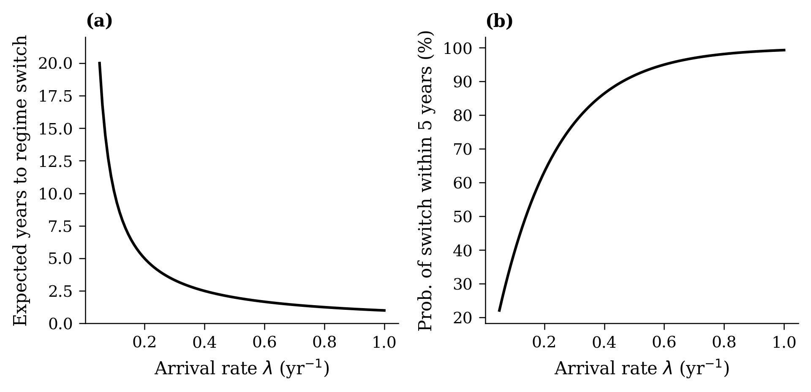
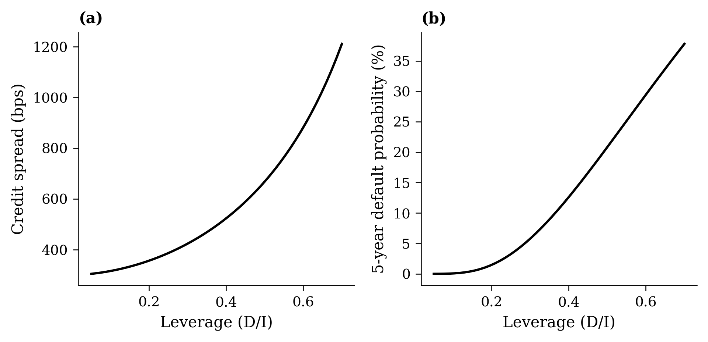
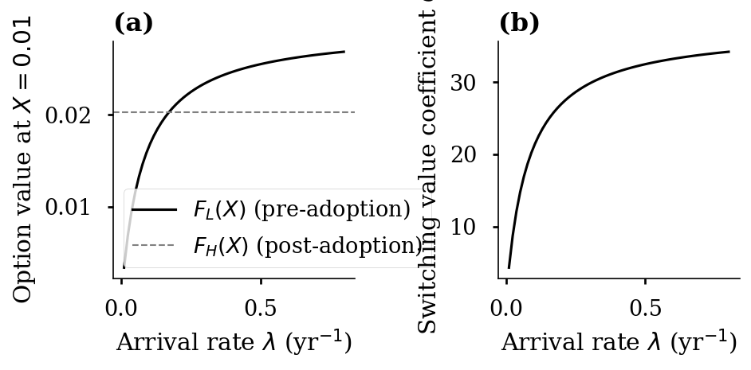

## Revealed Beliefs: Methodology

**Key insight**: All model parameters are observable *except* $\lambda$

::: {style="height: 0.5em;"}
:::

**Algorithm**:

1. Set observable parameters to firm-specific values ($r_i$, $\ell_i$, etc.)
2. For each candidate $\lambda$: solve model $\to$ predicted investment intensity
3. Find $\hat{\lambda}$ matching observed CapEx/Revenue

::: {.fragment}
$$\frac{I(K^*(\hat{\lambda}))}{V(X^*(\hat{\lambda}), K^*(\hat{\lambda}))} = \frac{\text{CapEx}_i}{\text{Revenue}_i}$$
:::

::: {.fragment}
In the spirit of @samuelson1938note: infer beliefs from *actions*, not *words*
:::

---

## What Does $\lambda$ Mean?

{width="90%"}

Range of disagreement ($\lambda \in [0.05, 0.5]$): 2--20 years expected, 22--92% in 5 years

---

## Credit Risk

{width="90%"}

Spreads exceed 1,200 bps and default prob. ~40% at $\ell = 0.70$

---

## The AI Investment Dilemma {.center}

> What is the cost of investing with the wrong $\lambda$?

---

## The AI Investment Dilemma: Setup

**Firm has**: true belief $\lambda_{\text{true}}$, invests using $\lambda_{\text{invest}}$

::: {.columns}
::: {.column width="50%"}
**Conservative** ($\lambda_{\text{invest}} < \lambda_{\text{true}}$):

- Invests too late
- Builds too little
- Misses revenue in boom
- *Lost opportunity*
:::
::: {.column width="50%"}
**Aggressive** ($\lambda_{\text{invest}} > \lambda_{\text{true}}$):

- Invests too early
- Builds too much
- Excess maintenance costs
- Default risk
- *Existential threat*
:::
:::

---

## The AI Investment Dilemma: Asymmetry

**Proposition 6**: Aggressive overinvestment is costlier than conservative underinvestment

::: {.fragment}
**Value loss**: $\Delta V = \text{NPV}(\lambda_{\text{true}}, \lambda_{\text{true}}) - \text{NPV}(\lambda_{\text{true}}, \lambda_{\text{invest}})$

The loss function is *asymmetric*: steeper on the aggressive side
:::

::: {.fragment}
**Implication**: Observed extreme investment can be rationalized **only** if firms genuinely hold high-$\lambda$ beliefs

$\Rightarrow$ Strategic posturing is too costly to explain the data
:::

---

## Option Value and $\lambda$

{width="90%"}

Pre-adoption value $F_L$ increases concavely toward post-adoption $F_H$ as $\lambda$ rises

---
